<!--
  ╔══════════════════════════════════════════════════════════════════╗
  ║  Aswanth Karuppannan — GitHub Profile README                      ║
  ║                                                                    ║
  ║  Locked design system (do not deviate):                            ║
  ║    Palette   base #0A0E14 · card #11151C · text #E6E8EB/#8B92A0    ║
  ║              accent gradient #3B82F6 -> #8B5CF6 · highlight #22D3EE ║
  ║    Motion    exactly 5 animated moments, everything else static:   ║
  ║              1 header name sweep   -> assets/header.svg            ║
  ║              2 terminal boot type  -> assets/terminal.svg          ║
  ║              3 "building" pulse dot -> assets/status.svg           ║
  ║              4 learning bars fill  -> assets/skills.svg            ║
  ║              5 contribution graph  -> activity-graph service       ║
  ║  All motion is external SVG (); GitHub strips inline <script>.║
  ╚══════════════════════════════════════════════════════════════════╝
-->

<!-- ═══════════════════════════ HEADER ═══════════════════════════ -->

 

 

 

<!-- ════════════════════════ DIVIDER ════════════════════════ -->

<!-- ══════════════════ TERMINAL BOOT SEQUENCE ══════════════════ -->

<!-- ═══════════════════ MISSION / HOW I WORK ═══════════════════ -->

### How I Work

I care more about systems that hold up under real load than systems that look good in a demo. Most of my work lives in backend architecture and database design — the parts that don't show up in a screenshot but decide whether everything else actually works.

<!-- ════════════════════════ CURRENT FOCUS ════════════════════════ -->

### Current Focus

&nbsp;&nbsp;**→**&nbsp;&nbsp;Architecting **TerraSentinel AI** — sequential domain-driven design across business objects, bounded contexts, aggregate roots, and database schema

&nbsp;&nbsp;**→**&nbsp;&nbsp;Building an **ESP32-based agricultural rover** (6-wheel skid steering)

&nbsp;&nbsp;**→**&nbsp;&nbsp;Deepening **full-stack fundamentals** — HTTP, JDBC, servlet architecture

<!-- ═══════════════════════ FEATURED PROJECTS ═══════════════════════ -->
<!-- Plain titles, plain descriptions. No marketing language, no badges. -->

### Featured Work

<table>
<tr>
<td width="50%" valign="top">

#### SmartAid
AI-POWERED EMERGENCY RESPONSE PLATFORM

Coordinates emergency response using real-time data and AI-driven prioritization to reduce response latency in critical situations.

</td>
<td width="50%" valign="top">

#### TerraSentinel AI
INFRASTRUCTURE INTELLIGENCE PLATFORM

A geospatial intelligence system for infrastructure and utility analysis, architected through a strict sequential design methodology — domain modeling through database architecture — with full traceability from findings back to source data.

</td>
</tr>
<tr>
<td width="50%" valign="top">

#### DigSafe
SMART HELMET SYSTEM · IEEE PUBLISHED

An IoT safety device for excavation and construction sites, detecting underground utility hazards in real time. Published research backing the hardware design.

</td>
<td width="50%" valign="top">

#### TrustTrade
FRAUD DETECTION PLATFORM

Identifies fraudulent trading patterns using anomaly detection across transaction data.

</td>
</tr>
<tr>
<td width="50%" valign="top">

#### CartWave
E-COMMERCE PLATFORM

A full-stack e-commerce system covering catalog, cart, and checkout flows with a modern frontend.

</td>
<td width="50%" valign="top">

#### Restaurant Management System
BACKEND INTERNSHIP PROJECT

End-to-end backend for restaurant operations — orders, inventory, and billing — built during a backend development internship.

</td>
</tr>
</table>

<!-- ════════════════════════ TECHNOLOGY STACK ════════════════════════ -->
<!-- The most static, least decorated part of the page. Reference, not showcase. -->

### Stack

<table>
<tr><td align="right"><b>Backend</b></td><td>&nbsp;&nbsp;Java · Spring Boot · Python · FastAPI · Node.js</td></tr>
<tr><td align="right"><b>Frontend</b></td><td>&nbsp;&nbsp;React · TypeScript · Tailwind CSS</td></tr>
<tr><td align="right"><b>Database</b></td><td>&nbsp;&nbsp;PostgreSQL · MySQL · MongoDB</td></tr>
<tr><td align="right"><b>AI</b></td><td>&nbsp;&nbsp;OpenAI APIs · LangChain · LLM integration</td></tr>
<tr><td align="right"><b>IoT</b></td><td>&nbsp;&nbsp;ESP32 · Arduino · Embedded Systems</td></tr>
<tr><td align="right"><b>Tools</b></td><td>&nbsp;&nbsp;Git · Docker · Linux</td></tr>
</table>

<!-- ═══════════════════ ARCHITECTURE PHILOSOPHY ═══════════════════ -->

### Architecture Philosophy

I design sequentially and lock decisions as I go: business objects before bounded contexts, bounded contexts before aggregate roots, aggregate roots before database schema. I'd rather move slower and not redo foundational decisions than move fast and rebuild later.

<!-- ════════════════════════ LEARNING ROADMAP ════════════════════════ -->
<!-- Honest qualitative labels, not percentages. Bars fill once (skills.svg). -->

### Currently Learning

 

<!-- ════════════════════════ GITHUB ACTIVITY ════════════════════════ -->
<!--
  Two cards max + the (naturally animated) contribution graph.
  All configured to the locked palette: bg #0A0E14, accents #3B82F6/#8B5CF6,
  highlight #22D3EE. No streaks, no trophies.
-->

### Activity

 

&nbsp;

  

<!-- ════════════════════════ PHOTOGRAPHY ════════════════════════ -->
<!--
  A quiet breath after the technical density. 3-4 images, clean grid,
  no animation, no filters. Drop images into assets/photography/ and
  uncomment the grid below.
-->

### Through a Lens

Away from the keyboard, I shoot — composition, light, patience. The same things software teaches: framing matters, details compound, simplicity is hard.

  

<!--

&nbsp;

&nbsp;

-->

Gallery coming soon — currently curating.

<!-- ════════════════════════════ CONTACT ════════════════════════════ -->

### Contact

 

[**Email**](mailto:aswanthksv@gmail.com)
&nbsp;·&nbsp;
[**LinkedIn**](https://linkedin.com/in/aswanth-karuppannan)
&nbsp;·&nbsp;
[**GitHub**](https://github.com/aswanth-ks)
&nbsp;·&nbsp;
[**Portfolio**](https://www.aswanthks.dev)

  

 

